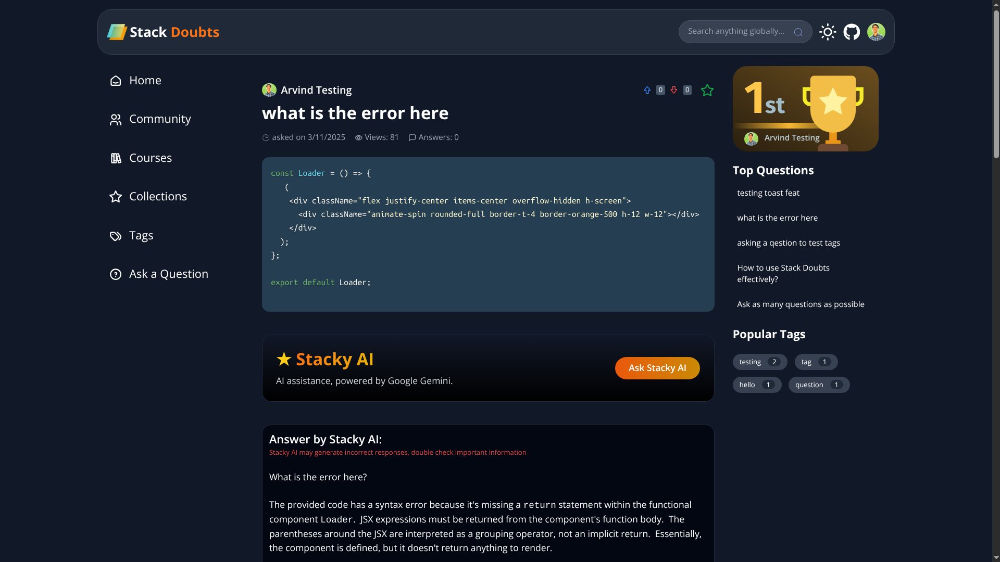

<div align="center">
  <h1>stack d🤔ubts</h1>
</div>

<div align="center">
  <p>
    An open-source knowledge-sharing platform for Q&A, real-time events, and community interaction.
  </p>
</div>

<div align="center">
  <a href="https://stack-doubts.vercel.app/">🏠 Website</a>
  <span> • </span>
  <a href="https://www.youtube.com/@arvindexplains">🎬 YouTube</a>
  <span> • </span>
  <a href="https://twitter.com/arvindpnditz">🐦 Twitter</a>
</div>

<div align="center">
  <a href="https://github.com/arvindpndit/stack-doubts">🔎 Explore Code</a>
</div>

---

## 🛠 Prerequisites

- Node.js v18+

---

## 🚀 Development Setup

1. **Clone the repository**:

   ```bash
   git clone https://github.com/arvindpndit/stack-doubts.git
   ```

2. **Navigate into the project directory**:

   ```bash
   cd stack-doubts
   ```

3. **Install dependencies**:

   ```bash
   npm install
   ```

4. **Configure environment variables**:

   Option 1 — manually create:

   - Create a new file named `.env.local` in the root
   - Add the following variables with your own values:

     ```dotenv
     NEXT_PUBLIC_CLERK_PUBLISHABLE_KEY=your_clerk_publishable_key
     CLERK_SECRET_KEY=your_clerk_secret_key
     NEXT_PUBLIC_TINY_URL_API_KEY=your_tinyurl_api_key
     MONGODB_URL=your_mongodb_connection_url
     WEBHOOK_SECRET=your_webhook_secret
     YOUTUBE_API=your_youtube_api_key
     GEMINI_API_KEY=your_gemini_api_key
     ```

   Option 2 — copy from example:

   ```bash
   cp .env.example .env.local
   ```

5. **Start the development server**:

   ```bash
   npm run dev
   ```

---

> 💡 **Need help?**
> DM me on [LinkedIn](https://www.linkedin.com/in/arvindpndit/) or [X/Twitter](https://twitter.com/arvindpnditz)

