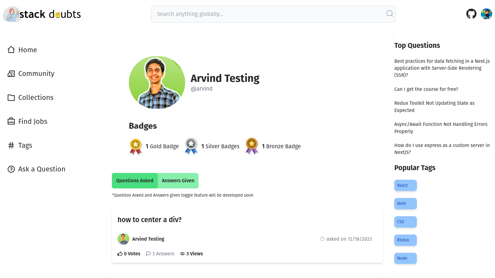

<div align="center">
  <h1>stack d🤔ubts</h1>
</div>

<div align="center">
  <p>A knowledge sharing opensource platform to facilitate Q&A, real-time events, and community interaction.</p>
</div>

<div align="center">
  <a href="https://stack-doubts.vercel.app/">🏠 Website</a>
  <span> • </span>
  <a href="https://www.youtube.com/@arvindexplains">🎬 YouTube</a>
  <span> • </span>
  <a href="https://twitter.com/arvindpnditz">🐦 Twitter</a>
</div>

<div align="center">
  <a href="https://github.com/arvindpndit/stack-doubts">🔎 Explore Code</a>
</div>

## Prerequisites

- Node.js v18+

## Development

1. Clone the repository:

```bash
git clone https://github.com/arvindpndit/stack-doubts.git
```

2. Enter the project directory:

```bash
cd stack-doubts
```

3. Install the dependencies:

```bash
npm i
```

4. Configure the env vars as described below -

   1. Create a new file named `.env.local` in your project's root directory
   2. Open the `.env.local` file in a text editor.
   3. Set the values of the environment variables with the appropriate values

```dotenv
NEXT_PUBLIC_CLERK_PUBLISHABLE_KEY=your_clerk_publishable_key
CLERK_SECRET_KEY=your_clerk_secret_key
NEXT_PUBLIC_TINY_URL_API_KEY=your_tinyurl_api_key
MONGODB_URL=your_mongodb_connection_url
WEBHOOK_SECRET=your_webhook_secret
```

5. Start the development server with:

```bash
npm run dev
```

> Note:
> If you encounter any problem in local setup, DM me on [LinkedIn](https://www.linkedin.com/in/arvindpndit/) or on [X/twitter](https://twitter.com/arvindpnditz)
